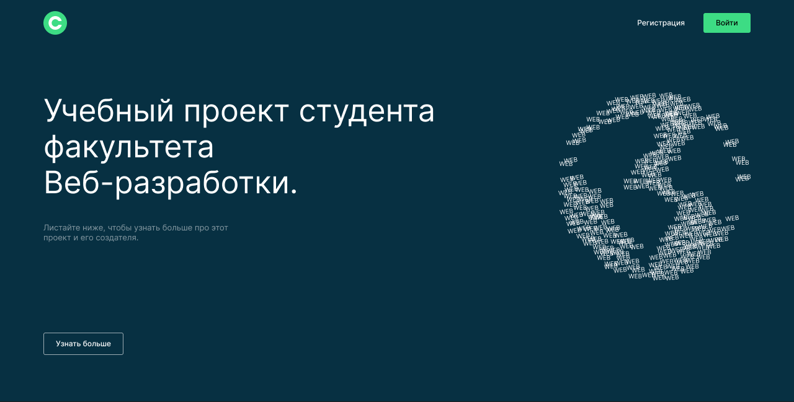
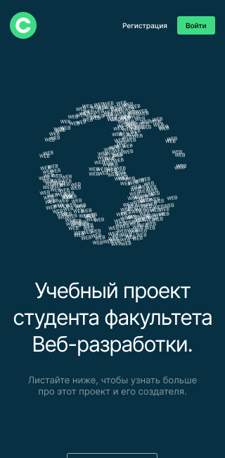
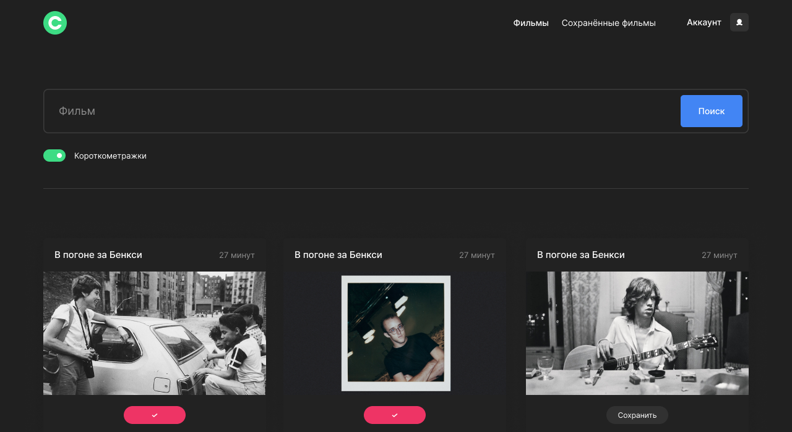
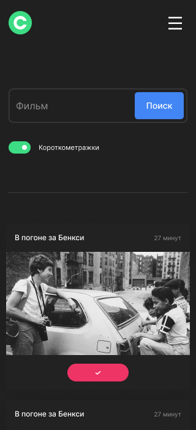

# Проект movies-explorer-frontend
Это учебный проект frontend части. 
Состоит из landing page и SPA приложения. 
Backend для данного проекта находиться [здесь](https://github.com/dv-loginov/movies-explorer-api) .


| Desktop                                            | Mobile                                           |
|----------------------------------------------------|--------------------------------------------------|
|  |  |
|         |          |


## Основной функционал
- регистрация и авторизация,
- получение информации о фильмах при помощи стороннего api
- поиск по названию и длинне фильма
- добавление, удаление и вывод добавленных фильмов,
- обновление персональных данных пользователя,

## Технологии
#### Frontend:
- [HTML5](https://www.w3.org/TR/2011/WD-html5-20110405/)
- [CCS3](https://www.w3.org/Style/CSS/specs.ru.html)
- [JavaScript (ES6)](https://262.ecma-international.org/6.0/)
- [Create React App](https://create-react-app.dev/)
- [React](https://ru.legacy.reactjs.org/)
- [БЭМ]()
- [Webpack]()

## Разработка

### Требования
Для установки и запуска проекта, необходим [NodeJS](https://nodejs.org/) v8+.
Для работы приложения необходимо запустить [backend.](https://github.com/dv-loginov/movies-explorer-api)

### Установка зависимостей
Для установки зависимостей выполните команду:
```sh
$ npm i
```
### Запуск Development сервера
Чтобы запустить сервер для разработки выполните команду:
```sh
npm run start
```
